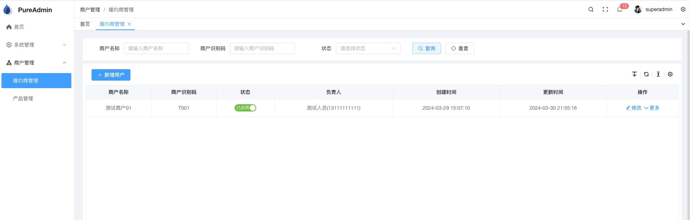
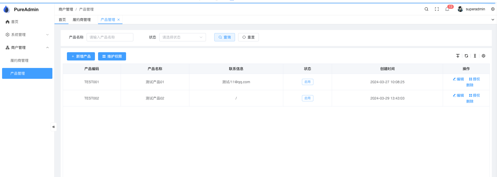
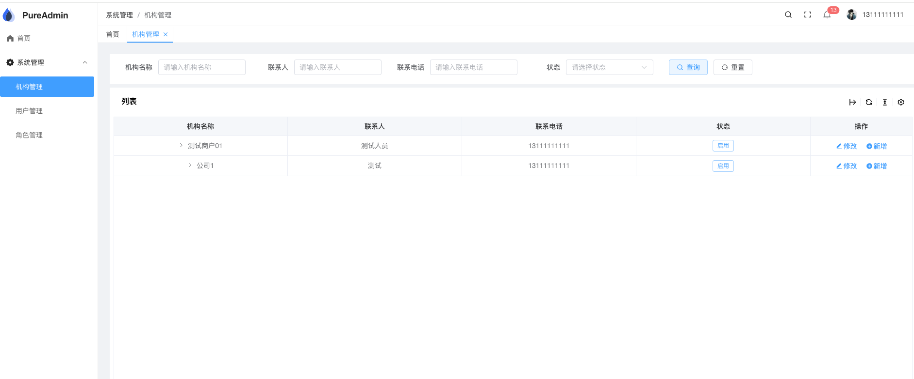
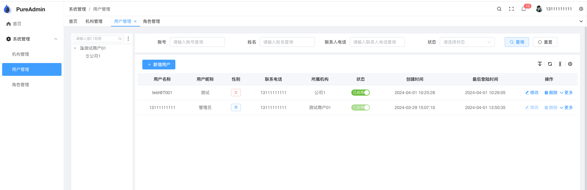
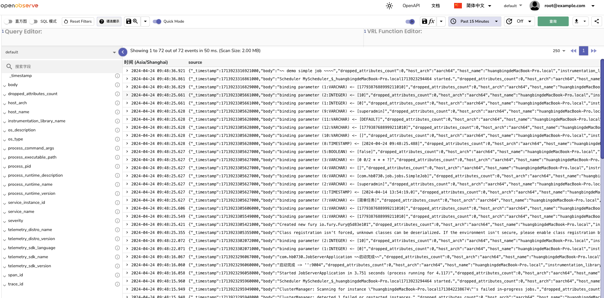
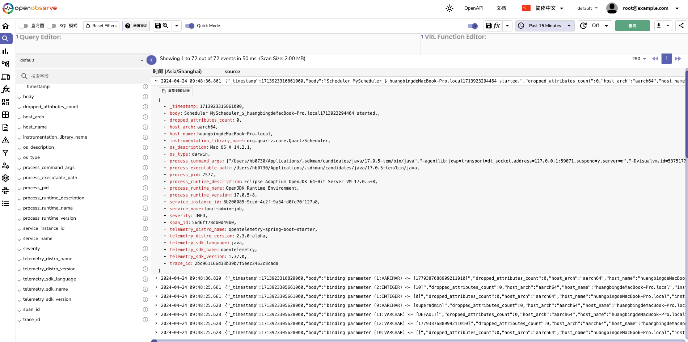
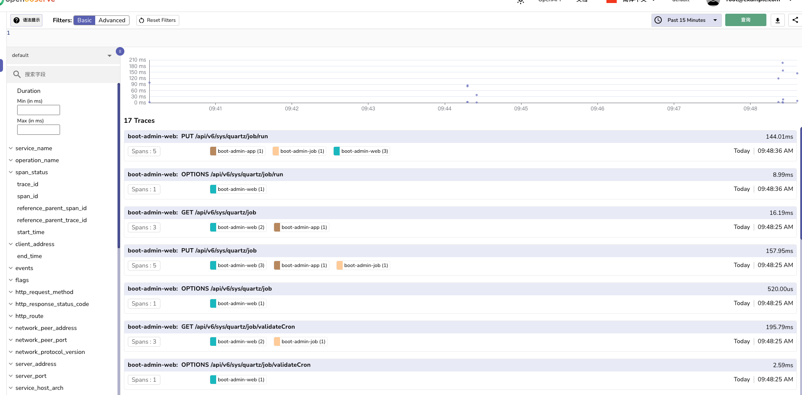
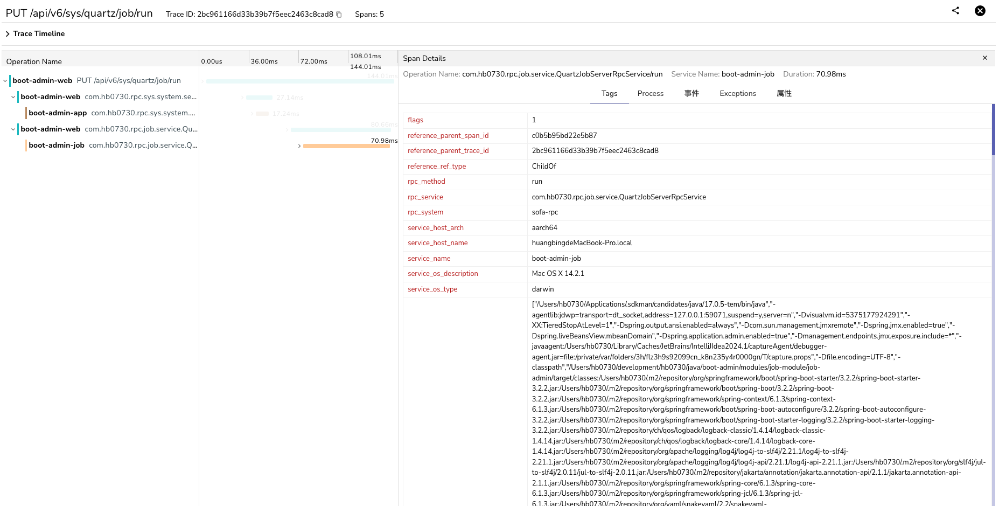

# BOOT ADMIN

> [boot-admin](https://github.com/hb0730/boot-admin)是一个基于[Spring Boot3](https://spring.io/projects/spring-boot)
> 和[Vue3](https://v3.cn.vuejs.org/)的`SAAS`管理后台开源项目，项目采用前后端分离的模式, 的开源项目，项目采用前后端分离的模式,
> 前端框架使用[vue-pure-admin](https://github.com/pure-admin/vue-pure-admin)

|                                  |                                  |                                  |
| -------------------------------- | -------------------------------- | -------------------------------- |
|  |  |  |
|  |  |  |

## 开源地址

|        | 前端                                                  | 后端                                               |
| ------ | ----------------------------------------------------- | -------------------------------------------------- |
| Github | [boot-admin](https://github.com/hb0730/boot-admin-ui) | [boot-admin](https://github.com/hb0730/boot-admin) |
| Gitee  | [boot-admin](https://gitee.com/hb0730/boot-admin-ui)  | [boot-admin](https://gitee.com/hb0730/boot-admin)  |

## 项目结构

```shell  ✔
├── admin # 管理后台 端口 9001
├── commons # 公共模块
├── docker # 本地开发环境
├── docs # 文档
│   ├── screenshot # 截图
│   └── sql # 数据库脚本
├── extends # 扩展
│   ├── job-module # 定时任务模块
│   │   ├── job-admin # 管理后台 端口 9004
│   │   ├── job-api # 定时任务api
└── modules # 模块
    └── sys-module # 系统模块
        ├── sys-biz # 业务
        ├── sys-rpc-api # rpc api
```

## 项目特点

- 前后端分离
- 前端采用[vue-pure-admin](https://github.com/pure-admin/vue-pure-admin) Vue3
- 后端采用[Spring Boot3](https://spring.io/projects/spring-boot)
- ~~采用 [Spring JPA](https://spring.io/projects/spring-data-jpa) 作为数据持久层~~
- 采用 [Mybatis Plus](https://baomidou.com/) 作为数据持久层
- 采用 [Spring Security](https://spring.io/projects/spring-security) 作为安全框架
- 采用 [Sofa RPC](https://github.com/alipay/sofa-rpc) 作为RPC框架
- 采用 [Open Telemetry](https://opentelemetry.io/) 作为日志和链路追踪

## 如何访问

### 本地开发环境

- 管理端: 地址：<http://localhost:8848/#/admin> `默认账号密码：suerpadmin/Admin123456`
- 默认商户端: 地址：<http://localhost:8848/> `默认账号密码：13111111111/Admin123456`

### 预览地址

- 管理端: 地址：<https://boot-admin.hb0730.com/#/admin> `默认账号密码：suerpadmin/Admin123456`
- 默认商户端: 地址：<https://boot-admin.hb0730.com> `默认账号密码：13111111111/Admin123456`

## open-telemetry

|                                             |                                             |
| ------------------------------------------- | ------------------------------------------- |
|        |        |
|  |  |
